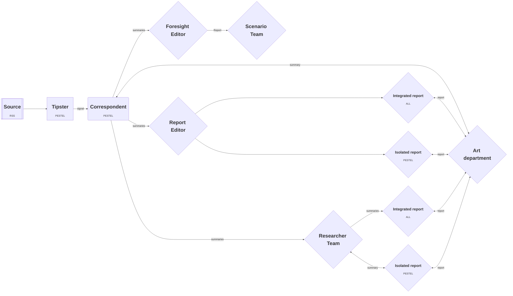
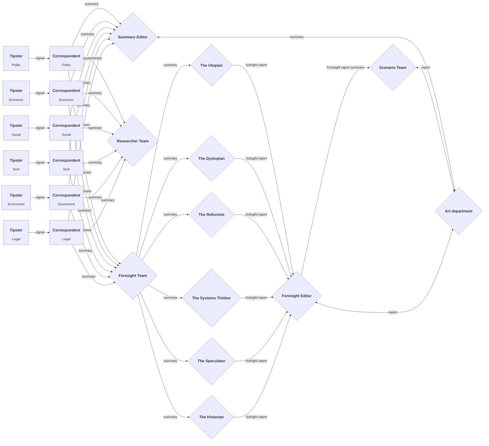

# Redaktionen API

**Redaktionen är ett API-experiment av Göteborgs regionens innovationsarena. Här försöker vi nyttja AI för att omvärldsspana, bearbeta och tillgängligöra information relevant för vår verksamhet.**

> [!CAUTION]
> Detta projekt ska inte uppfattas som en färdig produkt eller lösning. Ni är välkomna att kopiera koden och testa själva, men vi ansvarar inte för eventuella konsekvenser och har begränsade möjligheter att erbjuda support.

## Workflow

### Overview

### Detailed

## Project structure

### Core

Core stuff that multiple (all?) services are using.

### Services

A service is a key component in Redaktionen. The folder concists of the following:

| file       | responsibility                                                                                  |
| ---------- | ----------------------------------------------------------------------------------------------- |
| agent      | Responsible for AI operations.                                                                  |
| operations | Responsible for logic flow of the service, ex. _db operations_, _data transformations_.         |
| worker     | Responsible for triggering the service on incoming event and communication with other services. |
